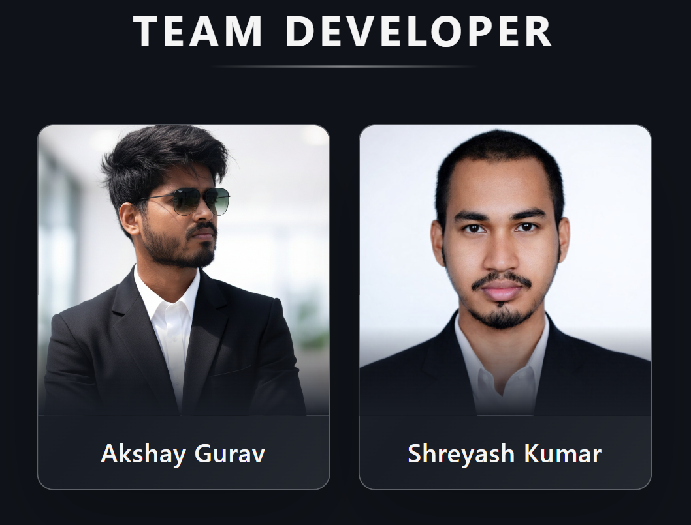

**FestPulse** is a state-of-the-art, real-time crowd monitoring and security management platform designed for large-scale festivals and events. Developed for **HackOverFlow**, a hackathon at **IIT Goa's Annual Techno-Cultural Fest, CULTRANG**, it leverages live data to ensure attendee safety and operational efficiency.

---

## Key Features

### Command Center (Dashboard)

* **Live Monitoring:** Real-time visualization of attendee counts across the entire festival grounds.
* **Venue Status:** Instant status updates (*Safe, Warning, Critical*) for individual venues.
* **HMR Support:** Fast, responsive UI with seamless live data updates.

### Interactive Live Heatmap

* **Visual Ground Overview:** High-fidelity, interactive map highlighting crowd-density hotspots.
* **Dynamic Indicators:** Venue nodes with pulsing alerts to indicate critical capacity levels.
* **Hover Insights:** Detailed per-venue analytics accessible directly from the map.

### AI Analytics & Predictions

* **Crowd Forecast:** AI-driven prediction charts forecasting crowd patterns for the next 4 hours.
* **Peak Hour Analysis:** Historical data comparison to identify peak attendee times.
* **Venue Popularity:** Pie charts showing real-time crowd distribution across zones.

### Secure Entry Ecosystem

* **Instant Registration:** Student-friendly portal for generating secure festival passes.
* **QR Technology:** Encrypted QR codes ensuring unique, non-duplicable entry tokens.
* **Ticket Management:** One-click download and registration management.

### Pro-Level QR Scanner

* **Dual Mode:** Seamless switching between **Real Camera Scanning** and **Manual Simulation Mode**.
* **Offline Detection:** Intelligent network detection with offline scan queuing support.
* **Haptic Feedback:** Physical feedback for successful entry and exit scans.

### Security & Safety

* **Threshold Alerts:** Automatic alerts when a venue reaches 90% or higher capacity.
* **Security Protocols:** Dedicated dashboard view for incident response and control.

---

## Technical Stack

* **Core:** React 18 + TypeScript
* **Build Tool:** Vite
* **Styling:** Tailwind CSS
* **UI Components:** Radix UI + Shadcn/UI
* **Animations:** Framer Motion
* **Charts:** Recharts
* **Icons:** Lucide React
* **Forms:** React Hook Form + Zod
* **State Management:** React Context API

---

## Getting Started

### Prerequisites

* Node.js (v18 or higher)
* npm or bun

### Installation

```bash
# Clone the repository
# (Link omitted for local development)

# Install dependencies
npm install

# Start development server
npm run dev
```

### Build for Production

```bash
npm run build
```

---

## Security

This project implements **CrowdPulse SecureEntry™ v2.0** protocols:

* Encrypted payloads for QR generation
* Real-time entrance and exit verification
* Protected API routes (Simulation)

---

## Developed By



* **Akshay Gurav**
* **Shreyash Kumar**

---

## License

© 2026 FestPulse Team. All rights reserved. Registered for use in **CULTRANG 2026**.
